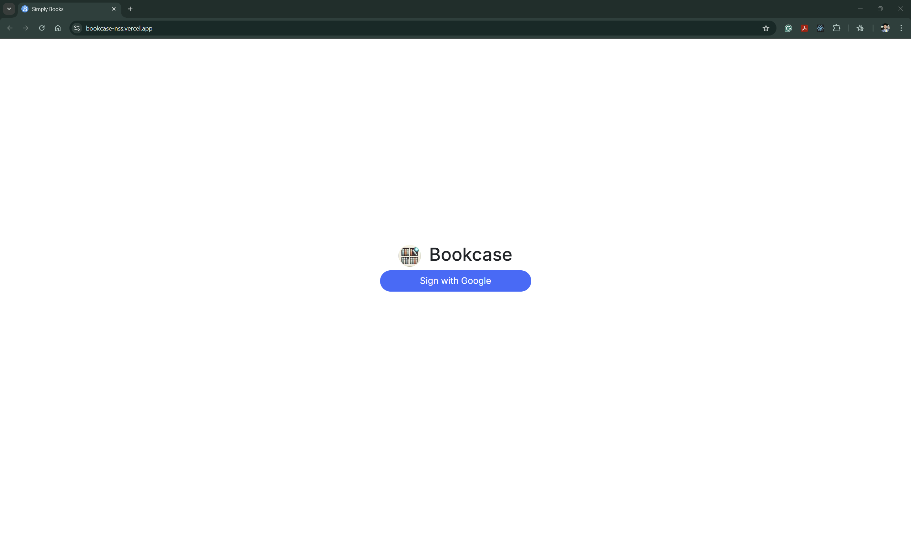
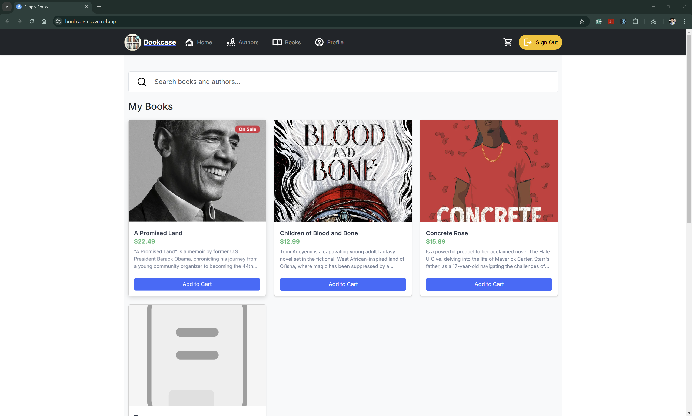
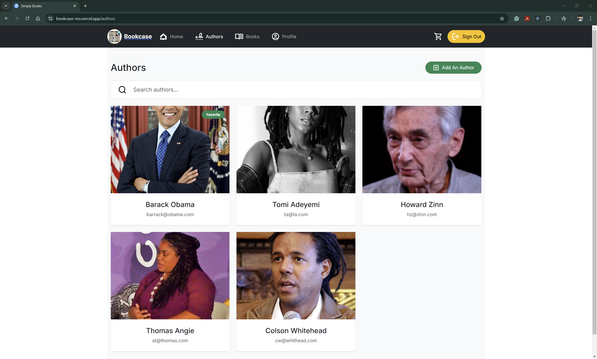
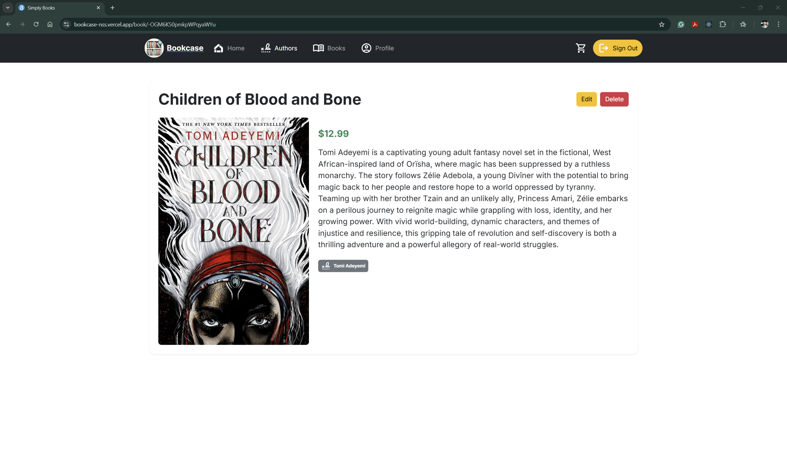
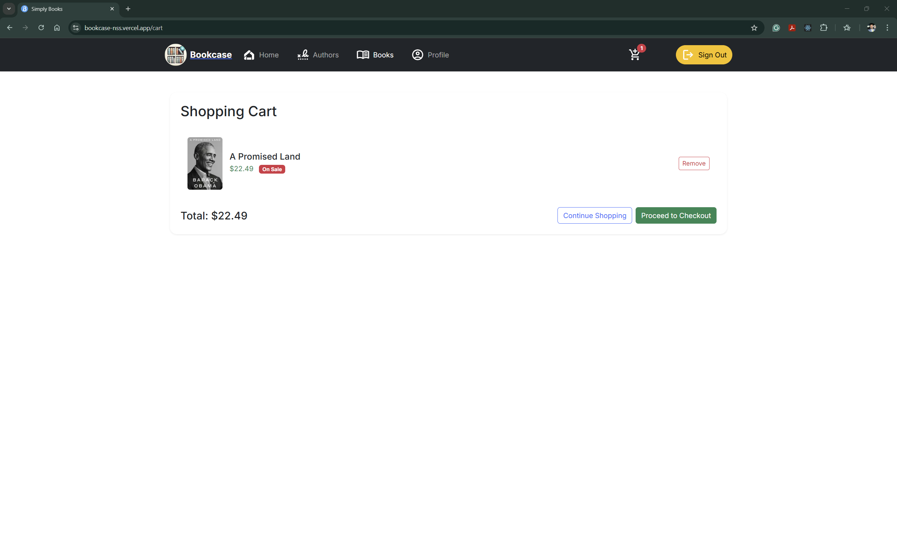
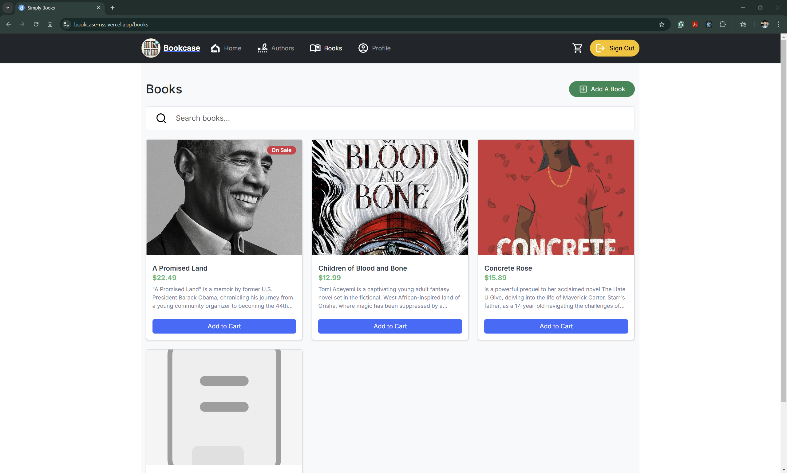
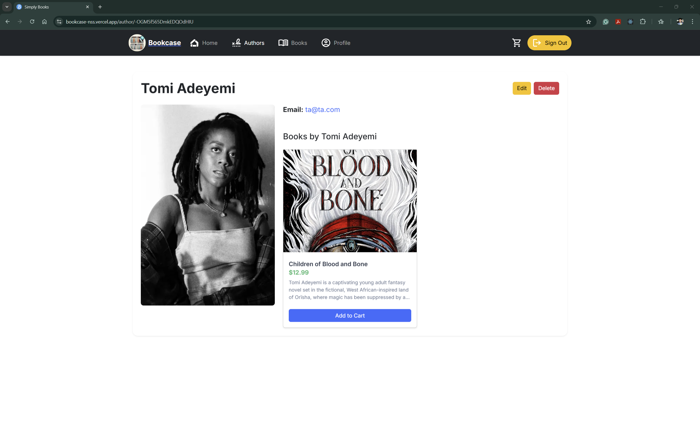
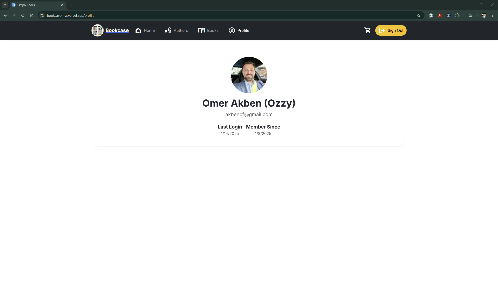

# 📚 Simply Books

A modern digital bookshelf application built with Next.js 14, Firebase, and Bootstrap. Manage your books and authors while enjoying a seamless shopping experience.

🔗 **[Live Demo](https://bookcase-nss.vercel.app/)**
🔗 **[Loom Demo](https://www.loom.com/share/36477c4a0915474abd0165d14fdb492d?sid=b3b87adb-0e8b-4fca-83fd-effd0da8c42d)**

## 🌟 Features

### Core Features
- **User Authentication**: Secure Google Sign-In integration
- **Book Management**: Create, read, update, and delete books
- **Author Management**: Full CRUD operations for authors
- **Responsive Design**: Seamless experience across all devices

### Shopping Cart Features
- **Cart Management**: Add/remove books from cart
- **Price Calculations**: Automatic price updates with sale discounts
- **Real-time Updates**: Instant cart total and count updates
- **Persistent Storage**: Cart data persists across sessions
- **Checkout Simulation**: Simple checkout process

### Search & Navigation
- **Unified Search**: Search across books and authors
- **Dynamic Filtering**: Filter books by title and description
- **Author Search**: Find authors by name and email
- **Real-time Results**: Instant search feedback

### UI/UX Features
- **Modern Interface**: Clean and intuitive design with Bootstrap 5
- **Loading States**: Smooth loading transitions
- **Error Handling**: User-friendly error messages
- **Responsive Images**: Optimized image loading with Next.js Image
- **Sale Badges**: Visual indicators for books on sale

## 📸 Screenshots

### Authentication

*Google Sign-In authentication page*

### Home Page & Book Management

*Home page showing the book collection and search functionality*

### Authors

*Authors page with author cards and management options*

### Book Details

*Detailed view of a book with author information*

### Shopping Cart

*Shopping cart with items and checkout options*

### Books

*A Book Page*

### Author

*An Author Page*

### Profile

*Profile loaded from Google*

## 🛠️ Technical Stack

### Frontend
- **Next.js 14.2**: React framework with App Router
- **React 18**: UI library
- **Bootstrap 5.3.3**: UI components and styling
- **React Bootstrap**: React components for Bootstrap

### State Management & Data
- **Firebase Realtime Database**: Data storage and real-time updates
- **Local Storage**: Cart state persistence
- **Context API**: Application state management

### Authentication
- **Firebase Authentication**: Google Sign-In
- **Protected Routes**: Route-based authentication

### Development Tools
- **ESLint**: Code linting
- **Prettier**: Code formatting
- **Husky**: Git hooks for code quality
- **PropTypes**: Runtime type checking

## 🚀 Getting Started

### Prerequisites
- Node.js 18.17 or later
- npm or yarn package manager
- Firebase account

### Installation Steps

1. **Clone the repository**
   ```bash
   git clone https://github.com/yourusername/simply-books.git
   cd simply-books
   ```

2. **Install dependencies**
   ```bash
   npm install
   ```

3. **Set up environment variables**
   Create a `.env` file in the root directory:
   ```env
   NEXT_PUBLIC_FIREBASE_API_KEY=your_api_key
   NEXT_PUBLIC_FIREBASE_AUTH_DOMAIN=your_auth_domain
   NEXT_PUBLIC_FIREBASE_PROJECT_ID=your_project_id
   NEXT_PUBLIC_FIREBASE_STORAGE_BUCKET=your_storage_bucket
   NEXT_PUBLIC_FIREBASE_MESSAGING_SENDER_ID=your_messaging_sender_id
   NEXT_PUBLIC_FIREBASE_APP_ID=your_app_id
   NEXT_PUBLIC_FIREBASE_DATABASE_URL=your_database_url
   ```

4. **Run the development server**
   ```bash
   npm run dev
   ```

5. **Open your browser**
   Navigate to [http://localhost:3000](http://localhost:3000)

## 📁 Project Structure

```
simply-books/
├── src/
│   ├── api/              # API functions for Firebase
│   ├── app/              # Next.js pages and routes
│   ├── components/       # Reusable React components
│   ├── styles/          # CSS and style modules
│   └── utils/           # Utility functions and contexts
├── public/              # Static assets
└── project-docs/        # Project documentation
```

## 🔑 Key Features Implementation

### Shopping Cart System
- Local storage-based cart management
- Real-time price calculations with sale discounts
- Cart persistence across page refreshes
- Automatic cart updates on book changes

### Authentication Flow
- Google Sign-In integration
- Protected route middleware
- User-specific data isolation
- Persistent authentication state

### Search Implementation
- Real-time search functionality
- Multi-field search (title, description, author)
- Debounced search for performance
- Search result highlighting

### Data Management
- Firebase Realtime Database integration
- Author-Book relationships
- Cascading deletes
- Real-time data updates

## 👥 Contributors

- **[Omer(OZZY) Akben](https://github.com/omerakben)**
  - Full Stack Development

## 🙏 Acknowledgments

### Technologies
- [Next.js](https://nextjs.org/)
- [Firebase](https://firebase.google.com/)
- [Bootstrap](https://getbootstrap.com/)
- [React Bootstrap](https://react-bootstrap.netlify.app//)
- [React Bootstrap](https://react-bootstrap.github.io/)

### Resources
- [React Icons](https://react-icons.github.io/react-icons/)
- [Google Fonts](https://fonts.google.com/)
- [Firebase Documentation](https://firebase.google.com/docs)
